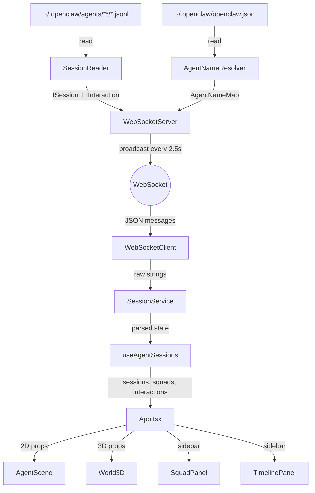

# Architecture

## System Overview

Agent Vision is a real-time monitoring dashboard that reads OpenClaw agent session data from the local filesystem and visualizes it in 2D and 3D scenes via a WebSocket-powered React application.

### Stack

| Layer | Technology | Version |
|-------|-----------|---------|
| Frontend | React + TypeScript + Vite | 19.2 / 5.9 / 8.0 |
| 3D Rendering | Three.js + React Three Fiber + Drei + Postprocessing | 0.183 / 9.5 / 10.7 |
| Backend | Express + Node.js | 5.2 |
| Real-time | WebSocket (ws) | 8.19 |
| Data Source | OpenClaw `.jsonl` session files + `openclaw.json` | — |

## Data Flow



### Step-by-step

1. **Server reads filesystem** — `SessionReader` scans `~/.openclaw/agents/<agentId>/sessions/*.jsonl`, parses each line as JSON, and produces `ISession[]` summaries with status derivation.

2. **Interaction detection** — For active sessions (running/waiting), `SessionReader.getInteractions()` analyzes the last 20 events within a 30s window, pattern-matching tool calls (`spawn*` → delegating, `send*` → consulting, `validate*` → validating) and text references to other agents.

3. **Name resolution** — `AgentNameResolver` reads `~/.openclaw/openclaw.json` and maps agent IDs to display names with emojis.

4. **WebSocket broadcast** — Every 2.5s, `WebSocketServer` broadcasts three messages to all clients: `sessions:update`, `agentNames:update`, `interactions:update`. On initial connection, sends sessions + names immediately.

5. **Frontend reception** — `WebSocketClient` handles the connection with auto-reconnect (3s delay). `SessionService` parses incoming JSON, dispatches by message type, and maintains state (sessions, names, timeline capped at 50, interactions).

6. **React hooks** — `useAgentSessions()` wires WebSocketClient + SessionService to React state, resolves display names, infers squad lanes, and maps sessions to squad members.

7. **Rendering** — `App.tsx` routes to either `AgentScene` (2D) or `World3D` (3D) based on selected scene. Sidebar panels (SquadPanel, TimelinePanel) render alongside.

## Frontend Architecture

### Layer Diagram

```
┌─────────────────────────────────────────────────────┐
│                    Components                        │
│  AgentScene · World3D · SquadPanel · TimelinePanel   │
│  OrchestratorView · CreatorPanel · SceneSelector     │
├─────────────────────────────────────────────────────┤
│                      Hooks                           │
│  useAgentSessions · useAgentMotion                   │
│  useInteractions · useSkillVisits                    │
├─────────────────────────────────────────────────────┤
│                    Services                          │
│  WebSocketClient · SessionService                    │
├─────────────────────────────────────────────────────┤
│              Config / Scenes / Types                 │
│  agentConfig · squads · skills · sceneConfig         │
│  ISession · IInteraction · ISquad · ISkill · ...     │
├─────────────────────────────────────────────────────┤
│                    Utilities                          │
│  officePathfinding · favicon                         │
└─────────────────────────────────────────────────────┘
```

### State Management

No external state library. State flows through:

1. **SessionService** — Centralized state container with callback-based reactivity (`onChange` listeners). Holds sessions, agentNames, timeline, interactions.
2. **React hooks** — `useAgentSessions` bridges SessionService to React via `useState` + `useEffect`. Computes derived state (squads, filtered data).
3. **Props** — Components receive data as props from `App.tsx`. No prop drilling beyond one level.
4. **Refs** — 3D motion state uses `useRef` exclusively to avoid React re-renders per frame (60fps).

## Backend Architecture

### Module Responsibilities

| Module | Responsibility | Reads | Produces |
|--------|---------------|-------|----------|
| `index.ts` | Bootstrap only. Wires modules, registers routes, starts server. | — | — |
| `SessionReader` | Read `.jsonl` files, parse events, derive status, detect interactions. | `~/.openclaw/agents/` | `ISession[]`, `IInteraction[]` |
| `AgentNameResolver` | Read `openclaw.json`, map agent IDs to display names. | `~/.openclaw/openclaw.json` | `AgentNameMap` |
| `WebSocketServer` | Manage connections, handle client messages, broadcast state. | — | WS messages |

### Status Derivation Logic

```
Last event < 8s ago?
  ├── YES → lastRole == "assistant" ? "running" : "waiting"
  └── NO → lastRole == "user" AND < 30s ago ? "waiting" : "idle"
```

### Interaction Detection

Only analyzes active sessions (running/waiting), last 20 events within 30s:

| Tool name pattern | Interaction type |
|------------------|-----------------|
| `spawn*`, `delegate*`, `dispatch*` | `delegating` |
| `send*`, `message*`, `notify*` | `consulting` |
| `validate*`, `review*`, `check*`, `verify*` | `validating` |

Text references to other agent IDs in user messages also produce `consulting` interactions.

## Avatar System

### Master vs Robot

Agents are rendered as one of two avatar types based on `agentConfig`:

| Type | Condition | Visual | Features |
|------|-----------|--------|----------|
| **Master** | `hairColor` defined in config | Humanoid body, head, hair, limbs | Glowing halo ring, configurable hair color |
| **Robot** | No `hairColor` | Metallic body, visor, angular limbs | Antenna with bob animation |

Both types share:
- Color from `agentConfig.color`
- Billboard name label (`AgentLabel3D`)
- Status-based emissive intensity
- Optional speech bubble overlay

### Animation States

| Status | Movement | Body | Details |
|--------|----------|------|---------|
| **Walking** (transitioning) | Leg pendulum, arm swing | Bounce + lean forward | Triggered when moving between rooms |
| **Running** (working) | Stationary | Forward lean, typing arms | Head nod, active emissive glow |
| **Waiting** (meeting) | Stationary | Upright, arm gestures | Head turns, moderate glow |
| **Idle** (relaxing) | Stationary | Lean back, slow bob | Slow halo/antenna movement, dim glow |

## Movement & Pathfinding System

### Room Graph

The office has 5 rooms connected by 6 doors:

```
┌──────────┐    ┌──────────────┐    ┌──────────┐
│  Lobby   │────│  Descanso    │────│ Trabajo   │
│          │    │  (break)     │    │ (work)    │
└────┬─────┘    └──────┬───────┘    └─────┬─────┘
     │                 │                  │
     │          ┌──────┴───────┐    ┌─────┴──────┐
     └──────────│ Comunicacion │────│ Biblioteca │
                │  (meeting)   │    │ (library)  │
                └──────────────┘    └────────────┘
```

### Pathfinding Algorithm

1. **BFS graph traversal** — `findPath(fromRoom, toRoom)` in `officePathfinding.ts` uses breadth-first search on the bidirectional room adjacency graph.
2. **Door waypoints** — Each door has a specific 3D coordinate. The path returns intermediate waypoints (door positions) for smooth transitions.
3. **52 furniture obstacles** — AABB collision boxes for desks, sofas, tables, bookshelves, etc.

### Motion System (`useAgentMotion`)

Three-pass per-frame algorithm (runs in `useFrame`, zero React overhead):

1. **Movement pass** — Linear interpolation toward current waypoint at `MOVE_SPEED=3.0` units/s. When within `ARRIVAL_THRESHOLD=0.15`, advance to next waypoint.
2. **Agent collision pass** — If two agents are within `COLLISION_DIST=0.8`, push apart perpendicularly by `PUSH_OFFSET=0.4`.
3. **Furniture collision pass** — Resolve AABB overlaps with `FURNITURE_MARGIN=0.4`.

Rotation uses shortest-path angle interpolation at `ROTATION_SPEED=2.0` rad/s.

### Zero React Overhead

The motion system is designed for 60fps without React re-renders:

- `useAgentMotion` returns a `Ref<Map<agentId, AgentMotionState>>`
- `AgentMotionSystem` renders `Agent3D` instances with a shared `motionRef`
- Each `Agent3D` reads its position from `motionRef.current` inside `useFrame`
- Position updates never trigger React state changes

## Interaction System

### Visualization

| Dimension | Component | Technique |
|-----------|-----------|-----------|
| 2D | `InteractionLines` | SVG quadratic bezier curves with gradients and dash animation |
| 3D | `InteractionBeam3D` | Catmull-Rom TubeGeometry with pulsing opacity (sine wave) |

### Interaction Types & Colors

| Type | Color | Meaning |
|------|-------|---------|
| `consulting` | Blue (`#4fc3f7`) | Agent seeking information from another |
| `validating` | Green (`#81c784`) | Agent reviewing/verifying another's work |
| `delegating` | Orange (`#ffb74d`) | Agent spawning/dispatching work to another |

### Lifecycle

1. Server detects interaction via tool calls or text references (last 30s)
2. Broadcast as `interactions:update` with `startedAt` + `durationMs`
3. Frontend `useInteractions` filters by active time window
4. Expired interactions removed automatically

## Agent Soul System

Each agent in `AGENT_REGISTRY` has a `soul` (`AgentSoul`) defining personality:

```typescript
interface AgentSoul {
  purpose: string;           // What this agent does
  workingPhrase: string;     // Shown when status = running
  delegatingPhrase: string;  // Shown when delegating to others
  idlePhrase: string;        // Shown when status = idle
  interactionStyle: InteractionStyle; // 'commanding' | 'analytical' | 'creative' | 'supportive'
}
```

Soul data drives:
- **Speech bubbles** — Activity-appropriate phrases displayed above agents
- **Behavioral context** — `interactionStyle` informs how interactions are visualized
- **Agent identity** — `purpose` provides tooltip/panel descriptions

## Scene System

### Scene Configuration

Scenes are pure data objects (`ISceneConfig`):

```typescript
interface ISceneConfig {
  id: string;
  title: string;
  backgroundImage: string;
  zoneDefs: ZoneMapping;    // status → zone position/size (%)
  zoneLabels: ZoneLabelMapping;
}
```

### Available Scenes

| ID | Title | Type | Description |
|----|-------|------|-------------|
| `oficina` | Oficina | 2D | Office background, 3 zones |
| `playa` | Playa | 2D | Beach background, same zones |
| `3d` | 3D World | 3D | Full R3F office environment |

### 3D World Environments

| ID | Theme | Description |
|----|-------|-------------|
| `office-hq` | Office HQ | Warm parquet floors, navy walls, 4500K lighting |
| `tropical-beach` | Tropical Beach | Wooden deck on sand, tiki hut, turquoise ocean |

### Room Assignment Logic (3D)

```
Agent department = investment → investment context
Agent department = development → development context

Status mapping:
  running  → Trabajo (work room)
  waiting  → Comunicacion (meeting room)
  idle     → Descanso (break room)

Out-of-context agents → Lobby
Orchestrators (main/samantha) → Always active, priority movement
```

### Status Debouncing (3D)

To prevent visual flickering from server timestamp oscillations:

| Transition | Delay |
|-----------|-------|
| idle → running/waiting | 0ms (immediate) |
| running ↔ waiting | 1000ms |
| running/waiting → idle | 3000ms (hold) |

## WebSocket Protocol

### Connection Flow

```
Client connects
    ↓
Server sends: sessions:update + agentNames:update
    ↓
Every 2.5s: sessions:update + agentNames:update + interactions:update
    ↓
Client can send: session:subscribe / session:unsubscribe
```

### Server Constraints

| Parameter | Value |
|-----------|-------|
| Push interval | 2,500ms |
| Max connections | 10 |
| Max message size | 4,096 bytes |
| Reconnect delay (client) | 3,000ms |

### Message Types

See [API.md](API.md) for complete message schemas.

## Security Considerations

- **Bind host**: `127.0.0.1` only (no external access by default)
- **Path traversal**: All file reads validate resolved paths stay within base directories
- **WS limits**: Max 10 connections, max 4KB messages
- **Message validation**: Unknown message types silently rejected
- **No authentication**: Designed for local development only

## Key Design Decisions

1. **WebSocket over polling** — Push-based updates instead of HTTP polling for lower latency and server load.
2. **Shared types** — `src/types/` imported by both frontend and server ensures compile-time contract consistency.
3. **Scenes as data** — Adding a scene = adding a config object, not writing new logic.
4. **Zero-render motion** — 3D agent positions update via refs inside `useFrame`, never triggering React reconciliation.
5. **SRP modules** — Each server module has exactly one responsibility (read files, resolve names, manage connections).
6. **Composition root** — `server/index.ts` only wires dependencies. All logic lives in dedicated classes.
7. **Callback-based state** — `SessionService` uses `onChange` callbacks instead of React Context to decouple services from the framework.
8. **Deterministic avatars** — Hash-based pixel art generation ensures consistent agent appearance across sessions.
9. **Lazy code splitting** — `World3D` (Three.js bundle) loaded only when user selects the 3D scene.
10. **Status debouncing** — Transition-specific delays prevent visual flickering from server timestamp oscillations.

## Related Documentation

- [API Reference](API.md) — REST endpoints + WebSocket protocol with request/response schemas
- [Component Reference](COMPONENTS.md) — All React and 3D components with props, purpose, and relationships
